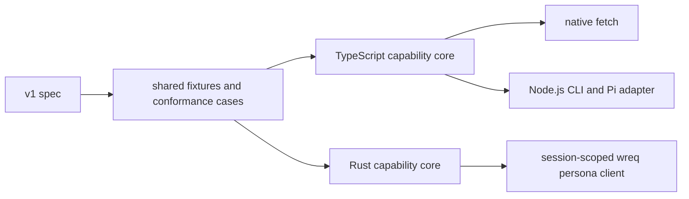
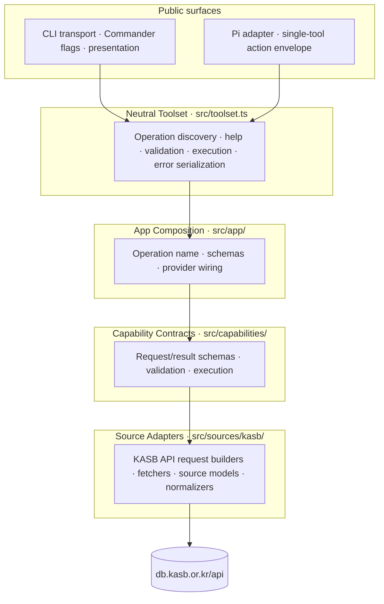
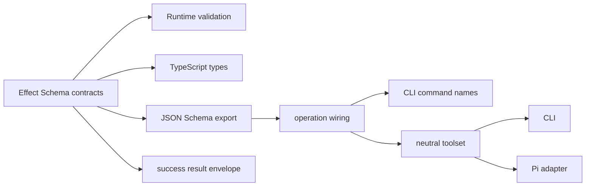

# Architecture

This repo tracks `../darty`'s app design while applying it to KASB standards access.

The system is becoming a read-only dual-SDK workspace. The implemented
TypeScript package remains supported while a native Rust SDK is added behind the
same semantic contract:

- `src/`: reusable capability core, source adapters, neutral toolset, CLI transport, product-specific Pi adapter, and app composition
- `fixtures/`: captured KASB API responses for deterministic tests
- `test/`: CLI, package-surface, fixture-backed, contract, and opt-in live checks
- `evals/`: later scenario evals after CLI behavior stabilizes
- `conformance/`: language-neutral serialized request/outcome cases shared by both SDKs
- `packages/kasb-ts/`: target home of the existing npm SDK, CLI, and Pi adapter
- `crates/kasb/`: target home of the native Rust SDK

The first CLI/toolset/Pi implementation exists at the repository root until the
phase-3 workspace move. The reusable TypeScript contract remains centered on the
CLI plus `@sjunepark/kasb/toolset`; the retained Pi adapter is a product-specific
host exception. Rust is an independently buildable native SDK, not a wrapper,
FFI layer, or second CLI. [MIGRATION.md](MIGRATION.md) owns transition gates.

## Big Picture

The transports are not the domain app. Each SDK owns native request types,
validation, capability execution, source adaptation, and typed failures. The
language-neutral authority is the v1 spec plus serialized conformance evidence,
not either implementation's internal types.

The first public capabilities are:

- `search-standards`
- `get-standard-structure`
- `get-section`
- `get-paragraph`
- `search-qna`
- `get-qna`

The reusable interfaces are `@sjunepark/kasb/toolset`, the native Rust `kasb`
crate, and the existing `kasb` CLI. The `@sjunepark/kasb/pi` export and
`pi.extensions` metadata remain supported only as the Pi host adapter. MCP,
database persistence, background ingestion, and a Rust CLI are not goals.

## Dual-SDK Boundaries



Compatibility is judged after serialization. Object key order is irrelevant;
array order, omission versus `null`, scalar types, typed failure codes, and
normalized content are significant. Only `metadata.fetchedAt` is canonicalized
in deterministic fixture tests.

## Layering



| Layer | Path | Owns |
|---|---|---|
| CLI transport | `src/cli.ts`, `src/cli/` | Parse CLI input, own help/examples/output flags, call shared operations, serialize JSON |
| Neutral toolset | `src/toolset.ts` | Public operation discovery, command help, examples, validation, execution dispatch, reusable agent guidance, cancellation, and error serialization |
| Pi adapter | `src/pi.ts`, `src/pi-extension.ts` | Product-specific Pi host wrapper with `help`, `command_help`, `validate`, and `run` actions over the neutral toolset |
| App composition | `src/app/` | Operation names, JSON Schemas, and default provider wiring for public surfaces |
| Capability | `src/capabilities/` | Public semantic request/result schemas, request resolution, typed failures, execution |
| Source | `src/sources/kasb/` | KASB API URLs, source response schemas, fetchers, normalization, source error mapping |

## Implementation Roots

- `src/toolset.ts` for neutral operation discovery, validation, execution dispatch, cancellation, and error serialization
- `src/pi.ts` and `src/pi-extension.ts` for the retained product-specific Pi host adapter
- `src/app/` for operation composition and default wiring
- `src/capabilities/` for public contracts and execution
- `src/cli/` for Commander commands, flags, help, and JSON serialization
- `src/sources/kasb/` for KASB endpoint access and source normalization
- `fixtures/`, `test/`, and `evals/` for captured source responses, verification, and later task scenarios

During phases 1–2 these TypeScript roots remain at the repository root. Phase 3
moves them as one unit to `packages/kasb-ts/`, adds the single
`crates/kasb/` crate, and keeps `fixtures/`, `conformance/`, `evals/`, and docs
shared at the repository root.

The first implementation established the current per-capability file shape. Continue that pattern unless a concrete refactor improves the layer boundaries.

## Behavior-First Core

The shared layer owns semantic behavior. The neutral toolset owns reusable operation metadata and validation. CLI and Pi own presentation and protocol details.



One source of truth should provide:

- runtime validation shape
- TypeScript request/result types
- success result schema
- JSON Schema for CLI-facing specs, the neutral toolset, Pi parameters, and internal agent-eval tool definitions
- operation examples, limitations, result summaries, and reusable agent guidance
- typed failure mapping and error serialization

`src/app/agent-tools.ts` exposes internal `kasb_*` tool definitions over the same app operations for eval/tool-use experiments.
This is not a separate public host transport; CLI commands, neutral toolset operations, and Pi action commands share the stable operation ids.

What stays CLI-local:

- CLI flags
- help text and examples that are specifically terminal-oriented
- pretty/verbose output controls
- terminal presentation

What stays Pi-local:

- host action parameter schema
- `content[]` text blocks and host result wrapping
- extension registration

## Runtime Flow

Runtime CLI flow:

```text
argv -> CLI transport -> app operation -> capability execution -> KASB source adapter -> https://db.kasb.or.kr/api/...
```

The CLI and neutral toolset both dispatch to the same app operations; the CLI keeps terminal-specific flags and output projections local. Trusted JS/TS hosts should use the neutral toolset in-process rather than depending on CLI flags or Pi parameters.

Runtime Pi flow for the retained product-specific adapter:

```text
Pi tool params -> Pi adapter -> neutral toolset -> app operation -> capability execution -> KASB source adapter
```

## Public Contract vs Source Contract

Keep two schema families separate:

- **Public capability schemas** use stable semantic fields such as `keyword`, `stdNum`, `indexDocumentId`, and `paraNum`.
- **Internal source schemas** model KASB response and endpoint details, including fields such as `searchWord`, `titleDocumentId`, `bigSeq`, `midSeq`, `smallSeq`, `littleSeq`, `documentType`, and raw paragraph HTML.

`titleDocumentId` is browser-route-facing and must stay internal in v1. `indexDocumentId` is the public v1 section retrieval id.

## Document Ownership

- [README.md](README.md)
  Minimal project orientation, status, reading order, and implementation roots.
- [VISION.md](VISION.md)
  Product-level goal, scope, principles, and non-goals.
- [docs/research/kasb-standard-source-map.md](docs/research/kasb-standard-source-map.md)
  Durable source investigation notes and observed API behavior.
- [docs/specs/](docs/specs/README.md)
  Stable, evidence-backed capability specs.
- [docs/tools/](docs/tools/foundations.md)
  Shared single-tool design guidance.
- [PRMOPT.md](PRMOPT.md)
  Historical implementation context for the accepted stack and first scaffold choices.
- [ROADMAP.md](ROADMAP.md)
  Historical phased direction and broad release sequencing.
- [TODO.md](TODO.md)
  Ordered near-term queue.
- `src/`
  Implementation root for the KASB capability core, source adapters, app composition, and CLI.

## Contributor Flow

1. Start with [README.md](README.md).
2. For product scope, read [VISION.md](VISION.md).
3. For source behavior, read [docs/research/kasb-standard-source-map.md](docs/research/kasb-standard-source-map.md).
4. For capability contracts, read [docs/specs/kasb-standards-v1.md](docs/specs/kasb-standards-v1.md).
5. For app layout and layer boundaries, use this file and keep parity with `../darty` where it still fits KASB.
6. For active work, use the ordered queue in [TODO.md](TODO.md).

## Invariants

- Public JSON request fields use camelCase; CLI flags use kebab-case.
- The success result schema contains `result`, `metadata`, `references`, and `warnings`; typed failures are separate from success schemas.
- Source adapters may know raw KASB fields; public capabilities expose stable semantic fields unless the spec explicitly promotes a source-facing exception, such as `search-qna.types`.
- Provider implementations return capability-shaped results, not raw source payloads.
- CLI commands import app/capability surfaces, not `sources/kasb/*` internals.
- CLI help, examples, and presentation options stay CLI-local.
- The neutral toolset is transport-neutral, server-friendly, and independent of Pi runtime types.
- The Pi adapter may wrap the neutral toolset, but it does not define the reusable SDK contract.
- Internal agent-eval tool names use the `kasb_*` namespace while preserving existing operation ids and CLI command names.
- CLI success output is JSON on `stdout`; CLI failure output is JSON on `stdout` with a nonzero exit code.
- MCP, database persistence, and background ingestion are not current implementation targets.
- Mark source observations as observed, inferred, or unverified when they affect contracts.
- The TypeScript and Rust SDKs remain independently buildable and do not invoke
  one another at runtime.
- The v1 spec is normative; implementation differences are classified rather
  than copied automatically.
- The existing Node.js CLI remains the sole CLI during the migration.

## Current Status

The repo currently has docs, source evidence, a v1 spec, a Darty-shaped
Bun/TypeScript tool package, and shared phase-1 conformance evidence. The Rust
workspace and pilot land only after their preceding migration gates pass.

Implemented roots:

- `package.json`
- `src/`
- `fixtures/`
- `test/`
- `scripts/build-cli.ts`
- `tsconfig.build.json`

The active migration milestone is phases 1–4 in [MIGRATION.md](MIGRATION.md):
freeze compatibility evidence, write the translation rulebook, create the
independently buildable workspace, and complete the Rust `get-paragraph` pilot.
Remaining Rust capabilities are a later phase.
