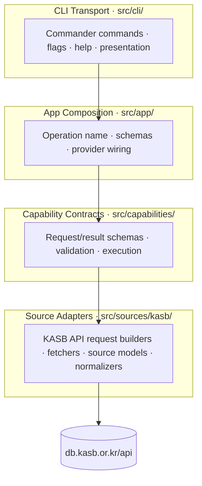
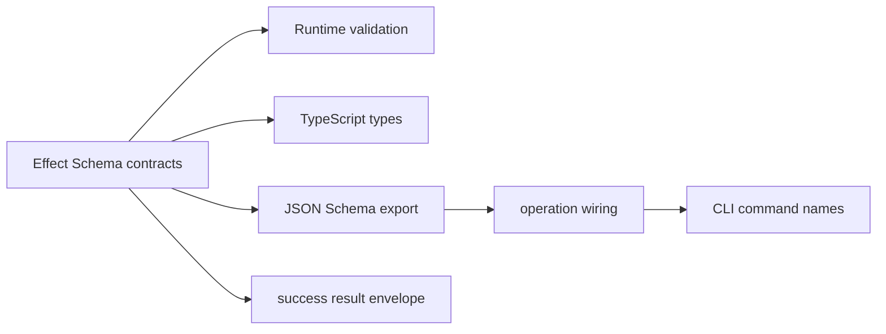

# Architecture

This repo should track `../darty`'s app design while applying it to KASB standards access.

The target system is a CLI-first, read-only TypeScript app:

- `src/`: reusable capability core, source adapters, CLI transport, and app composition
- `fixtures/`: captured KASB API responses for deterministic tests
- `test/`: broader CLI and opt-in live checks once code exists
- `evals/`: later scenario evals after the CLI works

The implementation is not scaffolded yet. This document defines boundaries and direction; exact files should be settled while scaffolding real code.

## Big Picture

The CLI is not the real app. The capability layer is: a semantic request contract, a provider interface, and an execution path that validates inputs, calls KASB source adapters, normalizes source results, and shapes typed success envelopes or typed failures.

The first public capabilities are:

- `search-standards`
- `get-standard-structure`
- `get-section`
- `get-paragraph`

The CLI is the only planned public interface. MCP, SDK, Pi-native tools, database persistence, and background ingestion are not implementation goals for this repo.

## Target Layering



| Layer | Target path | Owns |
|---|---|---|
| CLI transport | `src/cli.ts`, `src/cli/` | Parse CLI input, own help/examples/output flags, call shared operations, serialize JSON |
| App composition | `src/app/` | Operation names, JSON Schemas, and default provider wiring for the CLI |
| Capability | `src/capabilities/` | Public semantic request/result schemas, request resolution, typed failures, execution |
| Source | `src/sources/kasb/` | KASB API URLs, source response schemas, fetchers, normalization, source error mapping |

## Intended Implementation Roots

- `src/app/` for operation composition and default wiring
- `src/capabilities/` for public contracts and execution
- `src/cli/` for Commander commands, flags, help, and JSON serialization
- `src/sources/kasb/` for KASB endpoint access and source normalization
- `fixtures/`, `test/`, and `evals/` for captured source responses, verification, and later task scenarios

Start from `../darty`'s per-capability shape when scaffolding, but let the first real implementation decide exact file names.

## Behavior-First Core

The shared layer owns semantic behavior. The CLI owns presentation and protocol details.



One source of truth should provide:

- runtime validation shape
- TypeScript request/result types
- success result schema
- JSON Schema for CLI-facing specs
- typed failure mapping

What stays CLI-local:

- CLI flags
- help text and examples
- pretty/verbose output controls
- terminal presentation

## Runtime Flow

Target CLI flow:

```text
argv -> CLI transport -> app operation -> capability execution -> KASB source adapter -> https://db.kasb.or.kr/api/...
```

## Public Contract vs Source Contract

Keep two schema families separate:

- **Public capability schemas** use stable semantic fields such as `keyword`, `stdNum`, `indexDocumentId`, and `paraNum`.
- **Internal source schemas** model KASB response and endpoint details, including fields such as `searchWord`, `titleDocumentId`, `bigSeq`, `midSeq`, `smallSeq`, `littleSeq`, `documentType`, and raw paragraph HTML.

`titleDocumentId` is browser-route-facing and must stay internal in v1. `indexDocumentId` is the public v1 section retrieval id.

## Document Ownership

- [README.md](README.md)
  Minimal project orientation, status, reading order, and target roots.
- [VISION.md](VISION.md)
  Product-level goal, scope, principles, and non-goals.
- [docs/research/kasb-standard-source-map.md](docs/research/kasb-standard-source-map.md)
  Durable source investigation notes and observed API behavior.
- [docs/specs/](docs/specs/README.md)
  Stable, evidence-backed capability specs.
- [docs/tools/](docs/tools/foundations.md)
  Shared single-tool design guidance.
- [PRMOPT.md](PRMOPT.md)
  Working brief for accepted stack and implementation choices.
- [ROADMAP.md](ROADMAP.md)
  Strategic sequencing.
- [TODO.md](TODO.md)
  Ordered near-term queue.
- [PLAN.md](PLAN.md)
  One active detailed implementation plan.
- `src/`
  Future implementation root for the KASB capability core, source adapters, app composition, and CLI.

## Contributor Flow

1. Start with [README.md](README.md).
2. For product scope, read [VISION.md](VISION.md).
3. For source behavior, read [docs/research/kasb-standard-source-map.md](docs/research/kasb-standard-source-map.md).
4. For capability contracts, read [docs/specs/kasb-standards-v1.md](docs/specs/kasb-standards-v1.md).
5. For app layout and layer boundaries, use this file and mirror `../darty/src/ARCHITECTURE.md` when scaffolding.
6. For one active job, use [PLAN.md](PLAN.md); keep the ordered queue in [TODO.md](TODO.md).

## Invariants

- Public JSON request fields use camelCase; CLI flags use kebab-case.
- The success result schema contains `result`, `metadata`, `references`, and `warnings`; typed failures are separate from success schemas.
- Source adapters may know raw KASB fields; public capabilities expose only stable semantic fields.
- Provider implementations return capability-shaped results, not raw source payloads.
- CLI commands import app/capability surfaces, not `sources/kasb/*` internals.
- CLI help, examples, and presentation options stay CLI-local.
- CLI success output is JSON on `stdout`; CLI failure output is JSON on `stderr` with nonzero exit code and empty `stdout`.
- MCP, SDK, Pi-native tools, database persistence, and background ingestion are not current implementation targets.
- Mark source observations as observed, inferred, or unverified when they affect contracts.

## Current Status

The repo currently has docs, source evidence, and a v1 spec. It does not yet have:

- `package.json`
- `src/`
- `fixtures/`
- tests, CLI, or implementation code

The next milestone is to scaffold the Darty-shaped Bun/TypeScript implementation and then implement the four v1 capabilities fixture-first.
